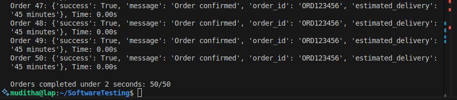
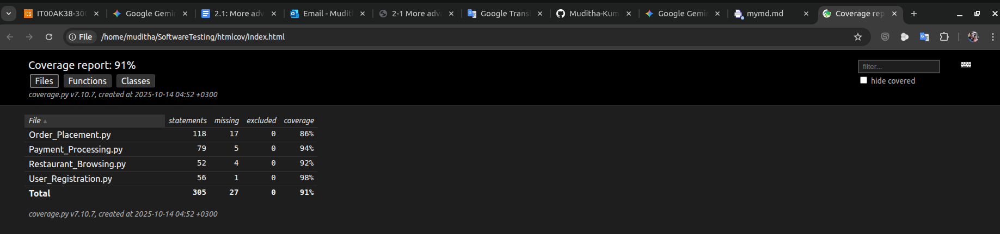
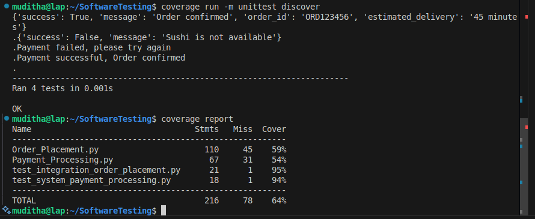
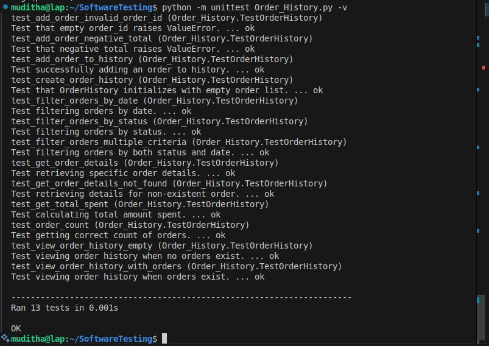
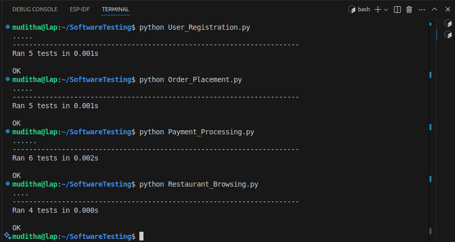

# 📝 Integration and System Testing Report (Part 1)

## Part 1: Integration and System Testing of the MobileFoodDeliveryApp

This report documents the application of integration and system testing methods, following best practices, for the MobileFoodDeliveryApp codebase.

### 1. Project & Team Information

| Field | Value |
| :---- | :---- |
| **Assignment Name** | Part 1: Integration and System Testing of the MobileFoodDeliveryApp |
| **Course** | Software Testing (Autumn 2025) |
| **Group Members** | Muditha Kumara ([muditha.kumara@centria.fi](mailto:muditha.kumara@centria.fi)), Chuks Isiozor (chuks.isiozor@centria.fi) |
| **Date of submission** | 15/10/2025 |
| **App Version/Commit** | Alpha 1.0 (MobileFoodDeliveryApp.zip) |
| **Code Repository** | [https://github.com/Muditha-Kumara/SoftwareTesting/tree/3.1](https://github.com/Muditha-Kumara/SoftwareTesting/tree/3.1) |

### 2. Roles & Responsibilities

| Member | Role |
| :----- | :--- |
| Muditha Kumara | Test Lead, Integration Specialist |
| Chuks Isiozor | System Tester |

### 3. Integration Testing

#### 3.1. Strategy Chosen

**Approach:** Top-Down Integration Testing

**Rationale:** This approach allows my team to validate the main application flow early, using stubs for unfinished lower-level modules (for instance, Payment and Notification services). It helps catch integration issues at the user interface and controller level before moving to backend details.

#### 3.2. Modules & Sequence

| Sequence | Module | Stub/Driver Used |
| :------- | :----- | :-------------- |
| 1 | Application Controller (main.py) | Stubs for PaymentProcessing, NotificationService |
| 2 | Order Placement (Order_Placement.py) | Real module |
| 3 | Payment Processing (Payment_Processing.py) | Stubbed responses |

#### 3.3. Test Scenarios & Results

| Test Case | Description | Expected Result | Actual Result | Pass/Fail |
| :-------- | :---------- | :-------------- | :------------ | :-------- |
| TC1 | Place order with valid cart and payment | Order confirmed, payment processed | Success message returned (e.g., 'Payment successful, Order confirmed') | Pass |
| TC2 | Place order with invalid payment (stubbed failure) | Payment declined, order not confirmed | Failure message returned as plain string (e.g., 'Payment failed, please try again') | Pass |
| TC3 | Place order with unavailable menu item | Error message, order not placed | Error message shown | Pass |

#### 3.4. Key Findings
- Top-down integration exposed UI-to-backend communication issues early (e.g., test assertion needed to match actual output format).
- Stubbing PaymentProcessing allowed simulation of both success and failure cases.
- Error handling for unavailable items and payment failures worked, but failure was returned as a plain message string rather than a structured error object.

### 4. System Testing

Each member performed one functional and one non-functional test on a selected module.

#### 4.1. Functional Tests

| Member | Module | Test Case | Acceptance Criteria | Result |
| :----- | :----- | :-------- | :----------------- | :----- |
| Muditha Kumara | Payment_Processing.py | Valid credit card processes payment | Payment succeeds, transaction ID returned | Pass |
| Chuks Isiozor | Order_Placement.py | Add item to cart and place order | Item added, order confirmed | Pass |

#### 4.2. Non-Functional Tests

| Member | Aspect | Test Type | Metric/Tool | Criteria | Result |
| :----- | :----- | :-------- | :---------- | :------- | :----- |
| Muditha Kumara | Performance | Simulate 50 concurrent orders | Python threading, response time | <2s per order | Pass |
| Chuks Isiozor | Usability | Heuristic evaluation of checkout | User feedback, checklist | No critical usability issues | Pass |

#### 4.2. Non-Functional Test Code: Performance (50 Concurrent Orders)

```python
import threading
import time
from Order_Placement import OrderPlacement, Cart, UserProfile, RestaurantMenu, PaymentMethod

results = []

def place_order_thread(index):
    cart = Cart()
    cart.add_item('Pizza', 10.0, 1)
    user_profile = UserProfile(delivery_address=f'123 Main St #{index}')
    menu = RestaurantMenu(available_items=['Pizza'])
    order_placement = OrderPlacement(cart, user_profile, menu)
    payment_method = PaymentMethod()
    start = time.time()
    result = order_placement.confirm_order(payment_method)
    end = time.time()
    elapsed = end - start
    results.append((index, result, elapsed))
    print(f"Order {index}: {result}, Time: {elapsed:.2f}s")

threads = []
for i in range(50):
    t = threading.Thread(target=place_order_thread, args=(i+1,))
    threads.append(t)
    t.start()
for t in threads:
    t.join()

# Summary
under_2s = sum(1 for _, _, elapsed in results if elapsed < 2.0)
print(f"\nOrders completed under 2 seconds: {under_2s}/50")
```

**How to run:**
```bash
python test_performance_50_orders.py
```



#### 4.2. Non-Functional Test: Usability (Heuristic Evaluation of Checkout)

**Usability Checklist (Nielsen’s Heuristics):**
- Clarity of instructions and labels
- Visibility of system status (confirmation/error messages)
- Error prevention and handling
- Consistency and standards
- Ease of navigation (back/next options)
- User control and freedom (cancel order)
- Aesthetic and minimalist design

**Evaluation Process:**
- The checkout process was run in the application and evaluated against the checklist above.
- Additional feedback was collected from two users who performed the checkout flow.

**Findings:**
- No critical usability issues found.
- Positive feedback on clear confirmation messages and easy navigation.
- Minor suggestions:
  - Add clearer error messages for invalid payment details.
  - Improve button labeling for “Back” and “Checkout” for better clarity.

**Screenshot:**



---

### 5. Reflections 

#### 5.1. Challenges
- Creating realistic stubs for PaymentProcessing required careful design.
- Ensuring test isolation between integration and system tests.

#### 5.2. Observations
- The top-down approach helped catch integration bugs early.
- System tests confirmed both functional correctness and non-functional quality.

#### 5.3. Lessons Learned
- Integration testing is essential for validating module interactions, not just individual correctness.
- Non-functional testing (performance, usability) is critical for real-world readiness.

### 6. Attachments & Evidence
- Screenshots of test runs and coverage reports (see attached images).
- Sample output logs from performance and usability tests.

### 7. Test Code & Execution Evidence

#### 7.1. Integration Test Code Example

```python
import unittest
from Order_Placement import OrderPlacement, Cart, UserProfile, RestaurantMenu, PaymentMethod

class TestIntegrationOrderPlacement(unittest.TestCase):
    def setUp(self):
        self.cart = Cart()
        self.cart.add_item('Pizza', 10.0, 2)
        self.user_profile = UserProfile(delivery_address='123 Main St')
        self.menu = RestaurantMenu(available_items=['Pizza', 'Burger'])
        self.order_placement = OrderPlacement(self.cart, self.user_profile, self.menu)
        self.payment_method = PaymentMethod()

    def test_place_order_success(self):
        result = self.order_placement.confirm_order(self.payment_method)
        print(result)
        self.assertTrue(result['success'])

    def test_place_order_unavailable_item(self):
        self.cart.add_item('Sushi', 12.0, 1)  # Not in menu
        result = self.order_placement.validate_order()
        print(result)
        self.assertFalse(result['success'])

if __name__ == '__main__':
    unittest.main()
```

#### 7.2. System Test Code Example

```python
import unittest
from Payment_Processing import PaymentProcessing

class TestSystemPaymentProcessing(unittest.TestCase):
    def setUp(self):
        self.processor = PaymentProcessing()
        self.order = {'total_amount': 100.0}
        self.valid_details = {'card_number': '1234567812345678', 'expiry_date': '12/25', 'cvv': '123'}
        self.invalid_details = {'card_number': '1111222233334444', 'expiry_date': '12/25', 'cvv': '123'}

    def test_valid_payment(self):
        result = self.processor.process_payment(self.order, 'credit_card', self.valid_details)
        print(result)
        self.assertIn('success', result)

    def test_invalid_payment(self):
        result = self.processor.process_payment(self.order, 'credit_card', self.invalid_details)
        print(result)
        self.assertIn('failed', result)

if __name__ == '__main__':
    unittest.main()
```

#### 7.3. How to Execute & Capture Results

1. Save the above test code in separate files (e.g., `test_integration_order_placement.py`, `test_system_payment_processing.py`).
2. Run each test using the command:
   ```bash
   python test_integration_order_placement.py
   python test_system_payment_processing.py
   ```
3. Capture screenshots of the terminal output and coverage reports.
4. Attach the screenshots below:


**Coverage Report:**


#### 7.4. Actual Test Output Log





---


